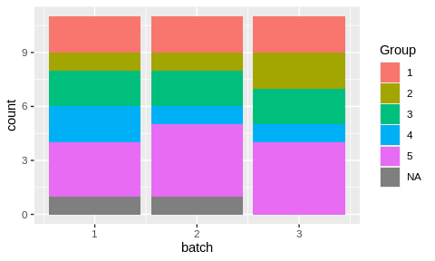
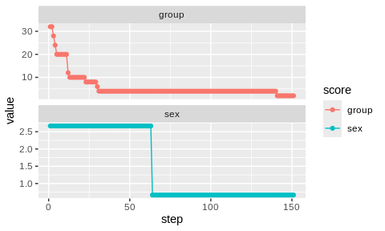

<!-- README.md is generated from README.Rmd. Please edit that file -->

# designit <a href="https://bedapub.github.io/designit/"></a>

<!-- badges: start -->

[](https://lifecycle.r-lib.org/articles/stages.html#experimental)
[](https://bedapub.github.io/designit/)
<!-- badges: end -->

The goal of designit is to generate optimal sample allocations for
experimental designs.

## Installation

You can install the development version from GitHub with:

``` r
# install.packages("devtools")
devtools::install_github("BEDApub/designit")
```

## Usage

### R in Pharma presentation
[](https://www.youtube.com/watch?v=mvPmSQJVy8o "Designit: a flexible engine to generate experiment layouts")

### Batch container
The main class used is `BatchContainer`, which holds the dimensions for
sample allocation. After creating such a container, a list of samples
can be allocated in it using a given assignment function.

### Creating a table with sample information

``` r
library(tidyverse)
library(designit)

data("longitudinal_subject_samples")

# we use a subset of longitudinal_subject_samples data
subject_data <- longitudinal_subject_samples %>% 
  filter(Group %in% 1:5, Week %in% c(1,4)) %>% 
  select(SampleID, SubjectID, Group, Sex, Week) %>%
  # with two observations per patient
  group_by(SubjectID) %>%
  filter(n() == 2) %>%
  ungroup() %>%
  select(SubjectID, Group, Sex) %>%
  distinct()

head(subject_data)
#> # A tibble: 6 × 3
#>   SubjectID Group Sex  
#>   <chr>     <chr> <chr>
#> 1 P01       1     F    
#> 2 P02       1     M    
#> 3 P03       1     M    
#> 4 P04       1     F    
#> 5 P19       1     M    
#> 6 P20       1     F
```

### Creating a `BatchContainer` and assigning samples

``` r
# a batch container with 3 batches and 11 locations per batch
bc <- BatchContainer$new(
  dimensions = list("batch" = 3, "location" = 11),
)

# assign samples randomly
set.seed(17)
bc <- assign_random(bc, subject_data)

bc$get_samples() %>%
  ggplot() +
  aes(x = batch, fill = Group) +
  geom_bar()
```

<!-- -->

Random assignmet of samples to batches produced an uneven distribution.

### Optimizing the assignemnt

``` r
# set scoring functions
scoring_f <- list(
  # first priority, groups are evenly distributed
  group = osat_score_generator(batch_vars = "batch", 
                               feature_vars = "Group"),
  # second priority, sexes are evenly distributed
  sex = osat_score_generator(batch_vars = "batch", 
                             feature_vars = "Sex")
)

bc <- optimize_design(
  bc, scoring = scoring_f, max_iter = 150, quiet = TRUE
)

bc$get_samples() %>%
  ggplot() +
  aes(x = batch, fill = Group) +
  geom_bar()
```

<!-- -->

``` r

# show optimization trace
bc$plot_trace()
```

<!-- -->

## Examples

See vignettes `vignette("basic_examples")`.

## Acknowledgement

The logo is inspired by [DALL-E 2](https://openai.com/dall-e-2/) and
[pipette icon by
gsagri04](https://openclipart.org/detail/140941/micropipette).
